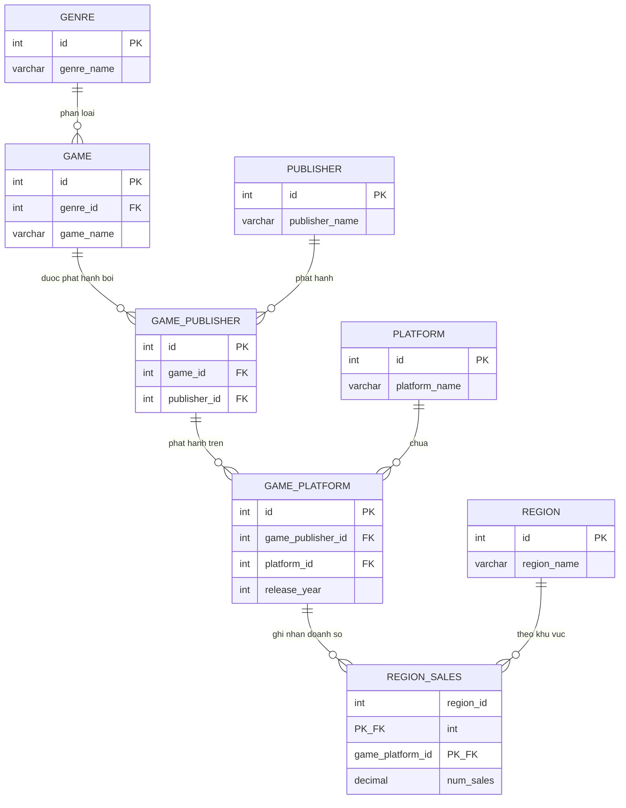

# Sơ đồ ER (Entity/Relationship) - Group7 Video Game Sales

Phụ trách: Hoàng (AI)

Sơ đồ dưới đây mô tả mô hình ER tương ứng với schema đã cài đặt trong [`sql/quantl3/G7_Dbscript.sql`](../sql/quantl3/G7_Dbscript.sql). Vẽ bằng cú pháp [Mermaid ER diagram](https://mermaid.js.org/syntax/entityRelationshipDiagram.html) - GitHub và nhiều trình xem Markdown render trực tiếp được, không cần cài thêm công cụ. Khi đưa vào `material/Report.docx`, export hình bằng cách paste đoạn mermaid vào https://mermaid.live rồi chụp/export PNG.

## Giải thích các entity và quan hệ

| Entity | Vai trò | Quan hệ |
|---|---|---|
| `genre` | Thể loại game (Action, RPG, Sports...) | 1 genre - N game |
| `game` | Một tựa game cụ thể | N game - 1 genre; 1 game có thể có N bản ghi phát hành (game_publisher) |
| `publisher` | Nhà phát hành game | 1 publisher - N game_publisher |
| `game_publisher` | Bảng trung gian: 1 game do 1 publisher phát hành | N-1 với game, N-1 với publisher; 1 game_publisher có thể có N bản phát hành theo platform (game_platform) |
| `platform` | Nền tảng chơi game (PS4, Xbox, PC...) | 1 platform - N game_platform |
| `game_platform` | Bảng trung gian: 1 bản phát hành (game_publisher) trên 1 platform, kèm năm phát hành | N-1 với game_publisher, N-1 với platform; 1 game_platform có N bản ghi doanh số theo vùng (region_sales) |
| `region` | Khu vực địa lý (NA, EU, JP, Other...) | 1 region - N region_sales |
| `region_sales` | Doanh số bán của 1 game_platform tại 1 region | N-1 với game_platform, N-1 với region (khoá chính phức hợp) |

## Lý do thiết kế 2 bảng trung gian (`game_publisher`, `game_platform`)

- Một game có thể được nhiều publisher phát hành ở các khu vực/thời điểm khác nhau (n-n giữa `game` và `publisher`) → tách thành `game_publisher`.
- Một bản phát hành (game_publisher) có thể ra mắt trên nhiều platform vào các năm khác nhau (n-n giữa `game_publisher` và `platform`) → tách thành `game_platform`.
- Doanh số (`region_sales`) gắn với từng cặp (`game_platform`, `region`) cụ thể, không gắn thẳng vào `game`, vì cùng 1 game trên các platform/publisher khác nhau có doanh số khác nhau.

> Xem đặc tả chi tiết từng thuộc tính tại [`docs/DataDictionary.md`](DataDictionary.md).
