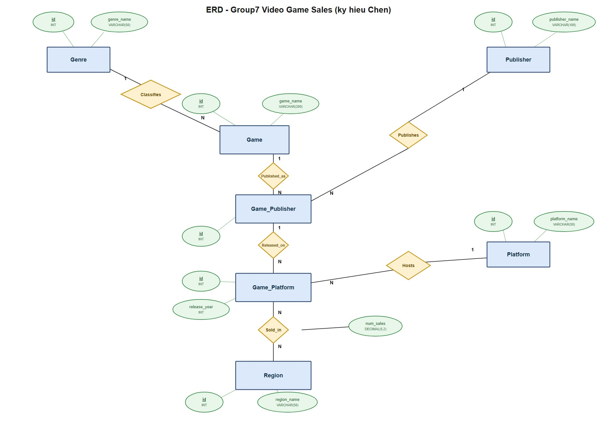

# Sơ đồ ER (Entity/Relationship) - Group7 Video Game Sales

Phụ trách: Hoàng (AI)

Sơ đồ dưới đây mô tả mô hình ER tương ứng với schema đã cài đặt trong [`sql/quantl3/G7_Dbscript.sql`](../sql/quantl3/G7_Dbscript.sql), vẽ theo **ký hiệu Chen** (entity = hình chữ nhật, relationship = hình thoi, attribute = hình oval, khoá chính gạch chân) - đúng chuẩn được yêu cầu trong đề bài, thay vì ký hiệu crow's foot của Mermaid.

File nguồn (vector, chỉnh sửa được): [`erd-dictionary/ERD.svg`](ERD.svg) - mở trực tiếp bằng trình duyệt để xem/phóng to, hoặc bằng Inkscape/Illustrator nếu cần sửa. File ảnh xuất sẵn để chèn vào báo cáo: [`erd-dictionary/ERD.jpg`](ERD.jpg).

## Giải thích các entity và quan hệ

| Entity | Vai trò | Quan hệ |
|---|---|---|
| `Genre` | Thể loại game (Action, RPG, Sports...) | 1 Genre - N Game (quan hệ `Classifies`) |
| `Game` | Một tựa game cụ thể | N Game - 1 Genre; 1 Game có thể có N bản ghi phát hành (`Game_Publisher`) qua quan hệ `Published_as` |
| `Publisher` | Nhà phát hành game | 1 Publisher - N Game_Publisher (quan hệ `Publishes`) |
| `Game_Publisher` | Thực thể trung gian: 1 Game do 1 Publisher phát hành | N-1 với Game (`Published_as`), N-1 với Publisher (`Publishes`); 1 Game_Publisher có thể có N bản phát hành theo nền tảng (`Game_Platform`) qua quan hệ `Released_on` |
| `Platform` | Nền tảng chơi game (PS4, Xbox, PC...) | 1 Platform - N Game_Platform (quan hệ `Hosts`) |
| `Game_Platform` | Thực thể trung gian: 1 bản phát hành (Game_Publisher) trên 1 Platform, kèm năm phát hành | N-1 với Game_Publisher (`Released_on`), N-1 với Platform (`Hosts`); N-N với Region qua quan hệ `Sold_in` |
| `Region` | Khu vực địa lý (NA, EU, JP, Other...) | N-N với Game_Platform qua quan hệ `Sold_in` |
| `Sold_in` | Quan hệ N-N giữa Game_Platform và Region, mang thuộc tính `num_sales` (tương ứng bảng `region_sales` trong mô hình quan hệ) | N Game_Platform - N Region |

## Lý do thiết kế 2 bảng trung gian (`game_publisher`, `game_platform`)

- Một game có thể được nhiều publisher phát hành ở các khu vực/thời điểm khác nhau (n-n giữa `Game` và `Publisher`) → tách thành thực thể trung gian `Game_Publisher`.
- Một bản phát hành (`Game_Publisher`) có thể ra mắt trên nhiều platform vào các năm khác nhau (n-n giữa `Game_Publisher` và `Platform`) → tách thành thực thể trung gian `Game_Platform`.
- Doanh số không gắn thẳng vào `Game`, mà gắn với từng cặp (`Game_Platform`, `Region`) cụ thể qua quan hệ N-N `Sold_in` (mang thuộc tính `num_sales`), vì cùng 1 game trên các platform/publisher khác nhau có doanh số khác nhau ở từng khu vực.
- Khi chuyển sang mô hình quan hệ (relational model), 2 thực thể trung gian `Game_Publisher`/`Game_Platform` trở thành bảng riêng (có khoá chính `id`), còn quan hệ N-N `Sold_in` trở thành bảng `region_sales` với khoá chính phức hợp `(region_id, game_platform_id)` - xem chi tiết trong `sql/quantl3/G7_Dbscript.sql`.

## Mô hình quan hệ, phụ thuộc hàm và chuẩn hoá 3NF

Sau khi chuyển mô hình ER sang mô hình quan hệ (relational model), mỗi entity/relationship mang thuộc tính trở thành 1 bảng với khoá chính (PK) và khoá ngoại (FK) tương ứng, đúng như đã cài đặt trong [`sql/quantl3/G7_Dbscript.sql`](../sql/quantl3/G7_Dbscript.sql):

| Bảng | Lược đồ quan hệ | Phụ thuộc hàm (Functional Dependency) |
|---|---|---|
| `platform` | platform(**id**, platform_name) | id → platform_name |
| `genre` | genre(**id**, genre_name) | id → genre_name |
| `publisher` | publisher(**id**, publisher_name) | id → publisher_name |
| `region` | region(**id**, region_name) | id → region_name |
| `game` | game(**id**, genre_id, game_name) | id → genre_id, game_name |
| `game_publisher` | game_publisher(**id**, game_id, publisher_id) | id → game_id, publisher_id |
| `game_platform` | game_platform(**id**, game_publisher_id, platform_id, release_year) | id → game_publisher_id, platform_id, release_year |
| `region_sales` | region_sales(**region_id, game_platform_id**, num_sales) | (region_id, game_platform_id) → num_sales |

### Vì sao các bảng đạt chuẩn 3NF

Một lược đồ đạt 3NF khi đã đạt 2NF (không có phụ thuộc bộ phận vào khoá chính) và không tồn tại phụ thuộc bắc cầu (transitive dependency) - tức không có thuộc tính không khoá nào phụ thuộc vào một thuộc tính không khoá khác.

- **Đạt 1NF:** mọi thuộc tính đều mang giá trị nguyên tố (atomic) - không có thuộc tính đa trị hay lặp nhóm.
- **Đạt 2NF:** 7/8 bảng (`platform`, `genre`, `publisher`, `region`, `game`, `game_publisher`, `game_platform`) có khoá chính là 1 cột (`id`) nên không thể có phụ thuộc bộ phận (partial dependency). Riêng `region_sales` có khoá chính phức hợp `(region_id, game_platform_id)`, nhưng thuộc tính không khoá duy nhất là `num_sales` phụ thuộc đầy đủ vào cả 2 cột của khoá (doanh số chỉ xác định được khi biết cả khu vực lẫn bản phát hành trên platform cụ thể), không phụ thuộc riêng vào `region_id` hay `game_platform_id` → không có phụ thuộc bộ phận.
- **Đạt 3NF:** ở từng bảng, các thuộc tính không khoá chỉ phụ thuộc trực tiếp vào khoá chính, không thuộc tính không khoá nào xác định một thuộc tính không khoá khác:
  - `game`: `genre_id` không xác định `game_name` (2 game khác nhau có thể cùng `genre_id` nhưng tên khác nhau, và không suy ra được tên từ thể loại) → không bắc cầu.
  - `game_publisher`: `game_id` và `publisher_id` độc lập với nhau (biết game không suy ra được publisher và ngược lại).
  - `game_platform`: `game_publisher_id`, `platform_id`, `release_year` độc lập lẫn nhau - platform không quyết định năm phát hành hay ngược lại.
  - `region_sales`: chỉ có 1 thuộc tính không khoá (`num_sales`) nên không thể có phụ thuộc bắc cầu.
  - Các bảng danh mục (`platform`, `genre`, `publisher`, `region`) chỉ có 1 thuộc tính mô tả duy nhất → hiển nhiên đạt 3NF.

  → Toàn bộ 8 bảng đều đạt **3NF**, không cần tách thêm.

> Xem đặc tả chi tiết từng thuộc tính tại [`erd-dictionary/DataDictionary.md`](DataDictionary.md).
